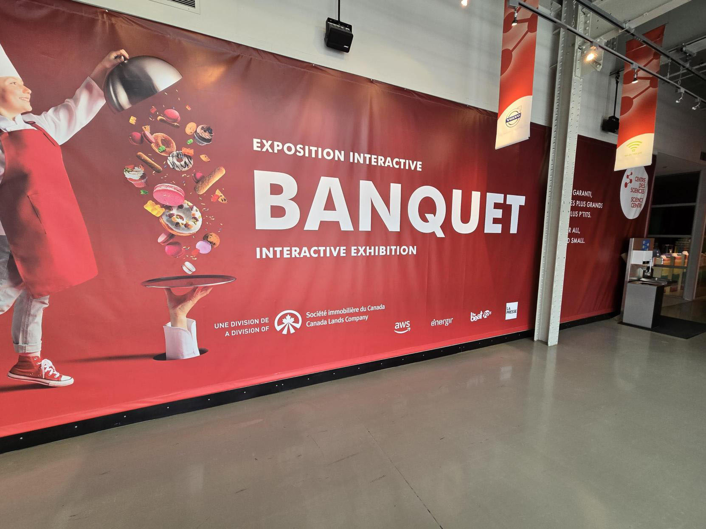

# Visite du centre des sciences

### Le nom de l'exposition visité:
Le Banquet

### Lieu : 
Centre des sciences de Montréal, 2, rue de la Commune Ouest, Montréal, Québec H2Y 4B2
 
### Type d'exposition :
Exposition interactive et immersive sur la gastronomie
 
### Date de visite :
À déterminer selon votre emploi du temps
 
### Titre du dispositif choisi : 
Le spectacle multimédia du banquet
 
### Nom de la firme : 
Cité des sciences et de l’industrie à Paris, en collaboration avec le chef Thierry Marx et l’Institut national de la recherche agronomique (INRA)
 
### Année de réalisation : 
2024
 
### Description du dispositif : 
Le spectacle est une œuvre multimédia et multisensorielle inspirée d'un menu conçu par le chef Thierry Marx, pionnier de la cuisine moléculaire en France, et le chef Raphaël Haumont. Il combine images, projections, sons et odeurs pour recréer l'atmosphère d'un banquet féérique, offrant une immersion complète dans l'art culinaire.
 
### Type d'installation : 
Immersive
 
### Mise en espace : 
La table s'anime dans un ballet d'ambiances, proposant un banquet féérique à dévorer avec les yeux.
CENTREDESSCIENCESDEMONTREAL.COM
 
### Composition et technique :
Utilisation de projections visuelles, de sons et d'odeurs pour créer une expérience multisensorielle.
 
### Éléments nécessaires à la mise en exposition : 
Systèmes de projection, dispositifs olfactifs, équipements sonores et scénographie adaptée pour une immersion totale.
