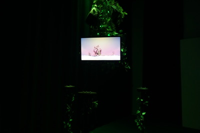
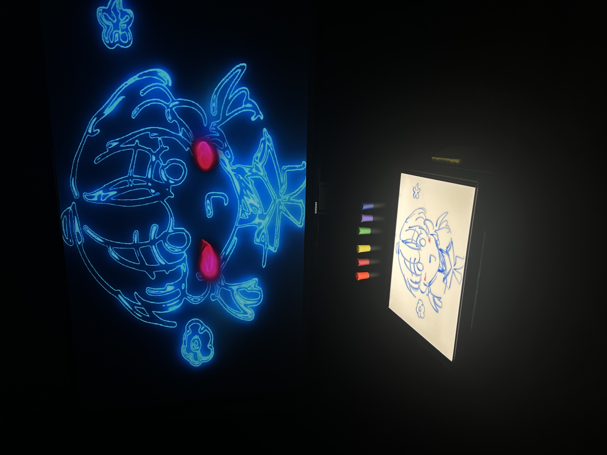
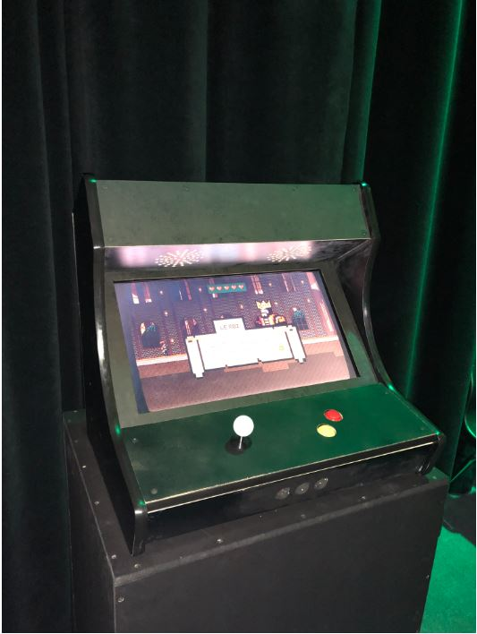

# Liste des projets resonnace du meilleure au moins meilleure
(toute les photos en etaient prise du cite web de chacuns des expos)
## 1 Fuga
(https://escapism-fuga.github.io/Fuga/#/)
### Artists
<table align="center">
<tr>
<td></td>
<td></td>
<td></td>
<td></td>
<td></td>
</tr>
<tr>
<td>Yavuz</td>
<td>Tristan</td>
<td>matis</td>
<td>abdel</td>
<td>daniel</td>
</tr>
</table> 

### instalation finale

### Shéma
<table align="center">
<tr>
<td></td>
<td></td>
<td></td>
<td></td>
<td></td>
</tr>
<tr>
</table>

### L'expérience vecus 
Pendant : Expériences variées entre apaisement, confusion et émerveillement. Certaines installations donnent un sentiment de contrôle, d’autres accentuent la perte de repères.
Après : Impression de flottement, entre calme et questionnement. Sensation d’avoir traversé un espace mental plus qu’un simple environnement interactif.

## 2 INTERNATURE
(https://tprangers.github.io/internature/)

### Artists
<table align="center">
<tr>
<td></td>
<td></td>
<td></td>
<td></td>
<td></td>
</tr>
<tr>
<td>Kenza</td>
<td>Sit Ver Mauve</td>
<td>Delphine</td>
<td>Isaac Farad</td>
<td>Khalytia Sing</td>
</tr>
</table> 

### instalation finale

### Shéma
<table align="center">
<tr>
<td></td>
<td></td>
</tr>
<tr>
</table>

### L'expérience vecus 
Avant  l’expérience: "Internature" me faisait penser à une fusion entre la nature et la technologie, ou peut-être entre intérieur et extérieur.

Après l’expérience : L’installation joue bien sur cette idée en intégrant des éléments naturels dans un environnement numérique. Le contraste entre les deux crée un effet intéressant qui rappelle l’importance du lien entre l’homme et la nature, même dans un contexte urbain.

## 3 Etheria
(https://ethereal-creators.github.io/Etheria/#/)

### Artists
<table align="center">
<tr>
<td></td>
<td></td>
<td></td>
<td></td>
<td></td>
</tr>
<tr>
<td>Joshua Gonzalez-Barrera</td>
<td>Victor Gileau</td>
<td>Michael Un Dupré</td>
<td>Pierre-Luc Proul</td>
<td>Maik Hamel</td>
</tr>
</table> 

### instalation finale

### Shéma
<table align="center">
<tr>
<td></td>
<td></td>
</tr>
<tr>
</table>

### L'expérience vecus 
Avant l'experience : Le nom évoque un univers un peu mystique, peut-être quelque chose d’onirique ou de surréaliste.

Après l’expérience : L’ambiance est vraiment immersive, avec une esthétique qui floute la frontière entre rêve et réalité. La combinaison des visuels et du son plonge totalement dans un monde alternatif. C’est une installation qui mise sur la contemplation et l’émotion..

## 4 C0N DU8
(https://gearshift-games.github.io/Web-C0N-DU8/#/)

### Artists
<table align="center">
<tr>
<td></td>
<td></td>
<td></td>
<td></td>
<td></td>
</tr>
<tr>
<td>Ian Corbin</td>
<td>Samuel Desmeules-Voyer</td>
<td>Alexandre Gervais</td>
<td>Keven Malric</td>
<td>Jérémy Roy-Coté</td>
</tr>
</table> 

### instalation finale

### Shéma
<table align="center">
<tr>
<td></td>
<td></td>
</tr>
<tr>
</table>

### L'expérience vecus 
Dès que j'ai entendu parler de "C0N DU8", j'ai tout de suite pensé à une référence au terme "conduit", lié probablement à des flux d'information ou des circuits. Je m'attendais donc à une installation qui explorerait le monde de la technologie, peut-être en mettant en avant les connexions numériques ou les réseaux de communication.

Après avoir expérimenté cette installation, j'ai été impressionné par le réseau complexe de canaux lumineux représentant des flux de données. L'interactivité permettait même de modifier ces flux, symbolisant notre impact sur les réseaux numériques. Une expérience qui m'a vraiment fait réfléchir à notre rôle dans l'écosystème numérique moderne.

## 5 Prismatica 
(https://pootpookies.github.io/Prismatica/)

### Artists
<table align="center">
<tr>
<td></td>
<td></td>
<td></td>
</tr>
<tr>
<td>Jérémy Duverseau</td>
<td>Vincent Delisle</td>
<td>Ikrame Rata</td>
</tr>
</table> 

### instalation finale

### Shéma
<table align="center">
<tr>
<td></td>
</tr>
<tr>
</table>

### L'expérience vecus 
Avant de découvrir "PRISMATICA", j'avais en tête des images de lumière, de couleurs et de reflets. Je m'attendais à une installation qui jouerait avec la diffraction de la lumière, peut-être à travers des prismes ou des surfaces réfléchissantes, offrant une expérience visuelle immersive.

Une fois que j'ai exploré cette installation fascinante, j'ai été totalement captivé par la manière dont la lumière interagissait avec les structures prismatiques, créant un magnifique spectre de couleurs en constante évolution. C'était à la fois apaisant et stimulant, offrant une nouvelle perspective à chaque angle d'observation.

## 6 Arcadia
(https://cousi-cousa.github.io/Arcadia/#/)

### Artists
<table align="center">
<tr>
<td></td>
<td></td>
<td></td>
</tr>
<tr>
<td>Dominic Yale</td>
<td>Anton Nikulin</td>
<td>William Beauvais</td>
</tr>
</table> 

### instalation finale

### Shéma
<table align="center">
<tr>
<td></td>
</tr>
<tr>
</table>

### L'expérience vecus 
Avant  l'expérience: Le terme "Arcadia" fait référence à un lieu utopique et naturel. Je m’attendais à une installation qui propose une vision idéalisée de la nature.

Après l’expérience : L’ambiance est effectivement apaisante, avec des images et des sons qui évoquent un paradis naturel. C’est une expérience immersive qui invite à la détente et à la réflexion sur notre rapport à la nature.

## Les classes necessaires
-Illustration numerique
-Animation 3d   
-Programation

## Une composante technologique
Une méthode technologique novatrice que j'ai récemment découverte dans le domaine des installations interactives est l'intégration de capteurs haptiques. Ces dispositifs permettent aux utilisateurs d'éprouver des sensations tactiles en réponse à des interactions numériques, ce qui enrichit considérablement l'expérience immersive. En rendant les interactions plus concrètes, ces capteurs donnent aux utilisateurs le sentiment d'une connexion plus profonde avec le contenu interactif, transformant ainsi leur engagement et leur perception de l'environnement numérique.

